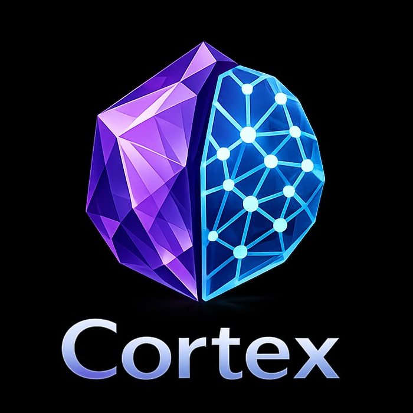
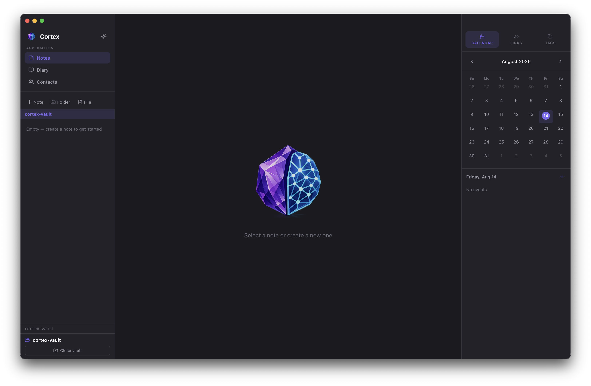

<div align="center">



<p>

[](https://github.com/ominatsune/cortex/blob/master/LICENSE)
[](https://github.com/ominatsune/cortex/releases/latest)
[](https://github.com/ominatsune/cortex)
[](https://github.com/ominatsune/cortex/stargazers)
[](https://github.com/ominatsune/cortex/issues)
[](https://github.com/ominatsune/cortex/commits/master)

</p>

</div>

---

# Cortex

An open-source cross-platform note-taking and personal knowledge management app for macOS, Linux, and Windows.

Cortex brings together Markdown notes, a daily diary, contacts, a built-in calendar, and vault-wide search — with everything stored as plain files in a local vault you fully own.

> [!WARNING]
> **Cortex is currently in early access.**
>
> The application is actively being developed and may contain bugs, incomplete features, or breaking changes. **Use Cortex at your own risk and keep regular backups of your vault and important data.**

<div align="center">

</div>

---
## Features

### Search
- **Vault-wide search** — a persistent search bar and a global `Cmd/Ctrl+K` command palette, both searching notes, diary entries, contacts, calendar events, and tags in one place
- Matches on content and title, and on **tags** — searching a tag surfaces every note, diary entry, contact, or calendar event it's attached to, not just a matching tag name
- Results are grouped by type and jump straight to the right note, entry, contact, or event; calendar results show their tags inline

### Notes & editing
- **Markdown notes** with a full formatting toolbar — headings, bold/italic/strikethrough/underline, inline code and code blocks, blockquotes, bullet/numbered/task lists, links, images, tables, and horizontal rules
- **Live preview editing** — markdown syntax renders inline as you type and reveals itself when your cursor is on that line
- **Folders** — organize notes in nested folder structures
- **Attachments** — attach files to notes or folders
- **[[Wikilinks]]** with autocomplete, plus a backlinks/outgoing-links panel for every note and diary entry
- **PDF export** — export any note as a PDF document
- A consistent action row across every note, diary entry, contact, and calendar event — Back navigation, a Read/Edit mode toggle, and Close/Delete, always in the same place

### Organization
- **Tags** — `#inline` tags or YAML frontmatter, with a filterable tag legend that works across notes, diary, contacts, and calendar events
- **Diary** — daily journal entries organized by year, with one-click access to today's entry

### Contacts & calendar
- **Contacts** — track email, phone, company, and freeform notes per contact
- **`@mentions`** — mention a contact anywhere in a note; mentions are colored, clickable, and navigable, with a Back button to return to where you were
- **Calendar** — a built-in calendar for events, where each event can link out to related contacts, notes, diary entries, and tags
- Events open in the main panel like notes and contacts, starting in Read mode with an Edit toggle; new contacts can be created and linked directly from an existing event, and the calendar view updates live as you edit

### Storage & sync
- **Local-first** — your data is plain Markdown files in a vault directory you choose; it stays fully accessible outside the app
- **Cloud vaults** — store your vault locally or in iCloud, Google Drive, OneDrive, or Dropbox
- **Self-healing vault** — required folders and metadata are quietly reinstated if anything gets deleted externally
- macOS: the vault folder gets a custom Finder icon, badged like other vault-based apps

## Architecture

```text
cortex/
├── packages/core/     Shared types, API interface, tag/markdown utilities
├── electron/          Desktop main process (Node.js file I/O)
└── src/               Desktop React UI (Electron renderer)
```

## Requirements

- Node.js 18+
- npm

## Getting Started

### Development

Clone the repository and install the dependencies:

```bash
git clone https://github.com/ominatsune/cortex.git
cd cortex
npm install
```

Start Cortex in development mode:

```bash
npm run dev
```

On first launch, Cortex will ask you to **select or create a vault**.

Vaults can be stored locally or in supported cloud storage such as:

- iCloud
- Google Drive
- OneDrive
- Dropbox

The active vault path is displayed in the bottom-left of the sidebar.

## Building

Build Cortex for production:

```bash
npm run build
```

### Packaging

| Command | Description |
|---|---|
| `npm run package:mac` | Build macOS `.dmg` |
| `npm run package:win` | Build Windows `.exe` installer |
| `npm run package:linux` | Build Linux AppImage and `.deb` |

## Data Storage

Cortex uses a **vault-based storage system**.

Your vault is simply a directory containing your notes and associated files:

```text
{your-vault-name}/
├── notes/
├── diary/
├── contacts/
└── ...
```

Because Cortex is local-first, your data remains accessible as regular files outside of the application.

## Roadmap

Cortex is under active development, and priorities may change as the project evolves.

See [ROADMAP.md](ROADMAP.md) for what's currently in progress, planned, and under consideration.

## Contributing

Cortex is open source and contributions are welcome.

Bug reports, feature requests, suggestions, and pull requests are appreciated.

If you encounter a problem, please [open an issue](https://github.com/ominatsune/cortex/issues).

## License

Cortex is licensed under the [MIT License](LICENSE).

---

> **⚠️ Early Access**
>
> Cortex is still under active development. **Use at your own risk and keep backups of important data.**
